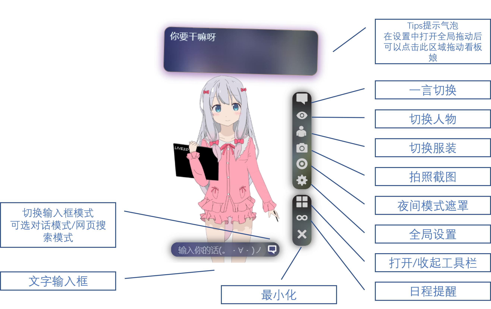

<h1 align="center"> Kanban-Desktop </h1>
<h3 align="center"> An AI Based Kanban for Windows and Linux* Desktop Users </h3>
 

### 🎉A kanban girl plugin that can put on your desktop! Designed for Windows and Linux desktop users with plenty of cloud models. Supports cloud and local moc2 model loading. Plenty of tools like NLP dialog, web search and schedule reminder. Continuously updating.

**Notice: This Readme(English Ver) is partly translated by deepL.com. We'll do our best to finish the translation work.**
---
## 🎰Functions available now:
- Specially designed UI with fake-blur theme and toolbox design for desktop users make it more elegant to use on the desktop.
- Carry on the past Web version, the app is connected with Tencent NLP API and is able to start conversations timely with texting.
- New ChatGPT chat mode allows you to chat with GPT-3.5-Turbo using the input box below. 
- You can conveniently switch the input box at the bottom of the app to web-searching mode and search whatever you want at any time with your customized search engines.
- Brand NEW calendar schedule reminder included. Kanban can automatically remind you by alerting with sound and visual effects after you input your remind time and context. The alert sounds are from MIUI default ringtone database.
- New bubble mode allows you to minimize the kanban girl by clicking the "×" button in the toolbox. The app will then minimize to a small bubble on the right-bottom side of your screen.
- We added many new models for our original cloud API. Meanwhile we also allow you to build your own web-API and fill your API's URL in the app's Settings page.
- Our project supports local live2d moc2 model file loading. You can select your local moc2 model's JSON manifest file and load your own model offline. If you don't have a local moc2 model, you can also select to still use the web API mode.
- We added the brand new 2x HD rendering system, which makes the kanban girl more suitable for high-resolution screens.
- The new version added the global settings function. In settings you can easily modify settings like toolbox showing functions,live2d api url,kanban behaviors and even try the experimental functions! Also, we'll add more setting selections in future versions.
- Our kanban girl plugin supports global dragging. You can drag the plugin to any place on your desktop by using your mouse to press and drag the plugin's dialog box.
- Many new functions are now under development. You can check for the project's developing process in the repository's Project Tab.
---
## 📺Installation:
Please step to the project's Release and download the latest installation pack. The Stable Release channel defaultly include one .zip package and another .exe package for Windows platform, alone with an .Appimage package packed under Endeavour OS Linux (Arch-based) for Linux users. Sadly Mac OS users need to manually build and pack the project due to device limitations.
 The Prerelease channel will push out preview versions. They have more unfinished brand NEW functions for you to try, but just as you can see, they're unfinished so they may have many bugs that can affect your using. Thus, please notice that the prerelease versions are only for testing.
Release URL:[Release](https://github.com/JimHans/kanban-desktop/releases)

---
## 📚User Manual:
 

---
## 📌Notice When Using:
- #### 1.This APP is developed with Electron framework. Thus, the APP supports cross-platform and can run on Windows, MacOS and Linux. We only provide Windows and Linux installation pack in our Release. If you want to run the APP on MacOS, pls clone the repository using `git clone` and pack locally by yourself.
- #### 2.When using the default NLP service, please notice that do not post TOO many request to reach our free API limit. We suggest you to register your own TCloud API by yourself, and fill your own API URL into the custom API blank in Settings. Knowing how to register your API, Please view the Appendix below.
- #### 3.The model files used in this project are copyrighted by the relevant copyright holders. Now the project has provided the option of self-built model API in the settings->Customize, and has added the local model loading function in the settings->Laboratory to avoid this restriction.
- #### 4.Due to the use of Electron for building, the performance overhead is slightly larger, also with higher power consumption, thus it's not recommended for notebooks, we suggest you to use it on your desktop for consumption.

---
## 🤔FAQ
* Q:Why doesn't the live2d model show up when I open the kanban?
* A:Depending on the network condition, you need to get the model data from the model API when you use it for the first time. Since the default API server does not have enough bandwidth (poor), it may take some time to load, please be patient or fill in other API address in the setting interface to improve the loading speed. In the future, this project will add local loading function to remedy this problem.
- Q:How can I turn off the ringing of the schedule reminder?
- A:You can turn off the ringing by clicking on the schedule notification poped-up after setting the schedule arrival time.
* Q:When will supports for moc3 model and native model files be added?
* A:Good question, the local model loading mode has been basically developed (it only works) and has been testing openly in the Prerelease channel, moc3 support is now on the schedule and will soon come out in the next version of the software.

 

*✨If you have more questions about the operation, deployment and code of this project, as well as better ideas for this project, please feel free to leave your comments under the Issue or Pull Requests for this project!*

---

## 📝Appendix:
- 1.If you need to apply for Tencent NLP natural language processing service by yourself, you can refer to the predecessor of this project - the web version of AI Watcher's NLP building tutorial, the link is as follows:[Deploy Tutorial](https://github.com/JimHans/AI-waifu)
- 2.The new local mode is still unstable and requires the `hit_areas_custom` configuration inside the model configuration manifest Json file in order to read the touch range and thus respond to the touch behavior. Other configurations that need attention I will sort out in the future. The corresponding Json visual configuration feature will also be included in the development plan in the future.
- 3.To use the ChatGPT Chat mode, you must have a OpenAI Account and the API Key. The software use the official API to get requests.

---
## 🧡Thanks to:

[live2d_demo / ©fghrsh / GPL v2.0][1]  
[live2d-widget / ©xiazeyu / GPL v2.0][2]  
[live2d_src / ©journey-ad / GPL v2.0][3]    
[AI-Waifu / ©jimhans / GPL v2.0][4]  
[ChatGPT-API / ©lxfriday / MIT license][5]  
[live2d_on_website / ©Himehane / GPL v2.0][6]  

Live2d Cubism SDK WebGL 2.1 Project & All model authors.

This program is subject to the terms of Cubism EULA.

Open sourced under the GPL v3.0 license.

### Thanks to the following project contributors:

### 🔗Annotation:
*: The support for Linux now is NOT perfect and have unexpected bugs.

**: Local model loading mode is only available in prerelease channel.

  [1]: https://github.com/fghrsh/live2d_demo
  [2]: https://github.com/xiazeyu/live2d-widget.js
  [3]: https://github.com/journey-ad/live2d_src
  [4]: https://github.com/JimHans/AI-waifu
  [5]: https://github.com/lxfriday/ChatGPT-API
  [6]: https://github.com/Himehane/live2d_on_website